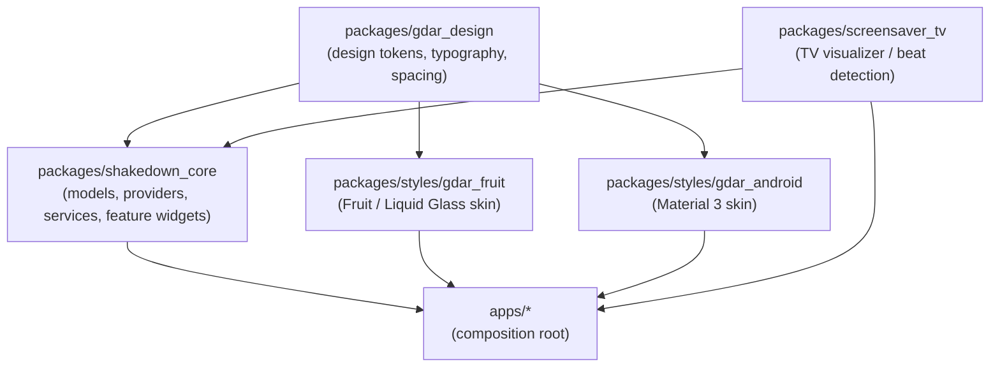

# Monorepo Architecture Plan

Date: 2026-04-02
Project: GDAR
Status: Implemented / Style-Core Graph Verified (2026-04-02)
Last verified against commit: `518adaa`

## Goal

Keep the workspace scalable by enforcing an acyclic package graph and clear
ownership boundaries between design, shared features, and app assembly.

## Implementation Status

Completed on 2026-04-01:

- `packages/gdar_design` was created and added to the workspace.
- shared font assets moved from `packages/shakedown_core/assets/fonts/` into
  `packages/gdar_design/assets/fonts/`.
- `packages/styles/gdar_fruit` and `packages/styles/gdar_android` now depend on
  `packages/gdar_design` and no longer depend on `packages/shakedown_core`.
- `packages/shakedown_core` now consumes shared design tokens and primitives
  directly from `packages/gdar_design`.
- `apps/gdar_mobile`, `apps/gdar_tv`, and `apps/gdar_web` remain the
  composition root, with app-layer theme assembly wired through the style
  packages.
- targeted regression and startup tests passed after the migration.

## Current State

The style/core package-graph migration described in this document is live in
the current repo snapshot:

- `packages/styles/gdar_fruit` depends on `packages/gdar_design`
- `packages/styles/gdar_android` depends on `packages/gdar_design`
- style packages do not depend on `packages/shakedown_core`
- app targets remain the composition root

The main structural risk is no longer a style-layer dependency cycle. The
remaining monorepo drag has shifted to maintainability hotspots in a handful of
large shared UI files, while the package boundaries themselves are currently in
the intended direction.

`packages/screensaver_tv/pubspec.yaml` currently appears as a minimal stub in
this workspace snapshot, so the `screensaver_tv` dependency edges below should
be treated as intended architecture and re-verified once that package manifest
is fully restored.

## Target Package Graph

Arrow legend: `A -> B` means **A depends on B**.

Preferred dependency direction:

`packages/gdar_design` -> `packages/shakedown_core`

`packages/gdar_design` -> `packages/styles/gdar_fruit`

`packages/gdar_design` -> `packages/styles/gdar_android`

`packages/shakedown_core` -> `apps/*`

`packages/styles/*` -> `apps/*`

`packages/screensaver_tv` -> `packages/shakedown_core`

`packages/screensaver_tv` -> `apps/gdar_tv`

Key rule:

- lower layers must not depend on higher layers
- style packages must not depend on feature packages
- apps are the composition root



## Recommended Package Responsibilities

### `packages/gdar_design`

Purpose: dependency-light shared design layer.

Should own:

- theme enums such as `ThemeStyle`
- color options such as `FruitColorOption`
- typography tokens
- spacing tokens
- shared font configuration
- reusable presentational primitives
- design-system helpers with no feature logic

Should not own:

- providers
- settings persistence
- feature toggles
- screens
- repositories or services

### `packages/shakedown_core`

Purpose: shared feature and application logic layer.

Should own:

- models
- repositories
- services
- providers
- shared feature widgets
- shared screens
- settings sections and feature composition

Should not own:

- app-specific bootstrap code
- theme-skin-specific visual tokens if they can live in design

### `packages/styles/gdar_fruit`

Purpose: Fruit skin implementation.

Should own:

- `ThemeData` construction for Fruit
- Fruit-specific presentational widgets
- Fruit-specific visual wrappers and surfaces
- Fruit-only visual composition that does not know feature logic

Should not own:

- `SettingsProvider`
- app feature sections
- business logic
- persistence

### `packages/styles/gdar_android`

Purpose: Android/Material skin implementation with the same boundary rules as
`gdar_fruit`.

### `packages/screensaver_tv`

Purpose: TV screensaver visualizer — beat detection, shader animation, PCM
audio capture.

Should own:

- `ScreensaverWidget` and supporting visualizer widgets
- beat detection logic and audio capture services
- TV-specific foreground service coordination

Should not own:

- generic audio playback (that lives in `shakedown_core`)
- settings persistence
- any Fruit or Material theme code

Dependency rule: may depend on `shakedown_core`; must never be depended on by
`shakedown_core` or any style package.

### `apps/gdar_mobile`, `apps/gdar_tv`, `apps/gdar_web`

Purpose: app composition root.

Should own:

- app bootstrap
- provider wiring
- route bootstrapping
- platform entrypoint details
- app-specific assembly of themes and shared features

## Practical Ownership Rule

Use this rule when placing code:

- If code knows about `SettingsProvider`, providers, setting keys, feature
  state, or screen composition, it belongs in `shakedown_core`.
- If code only knows about spacing, typography, color, surfaces, and visual
  presentation, it belongs in `gdar_design` or a style package.

## What This Means For Fruit Settings UI

Example: `packages/shakedown_core/lib/ui/widgets/settings/interface_section.dart`

Best placement:

- keep the section itself in `shakedown_core`
- move reusable Fruit spacing/header primitives into the design layer
- let the section compose those primitives without moving settings logic

This preserves clean ownership:

- feature composition stays in core
- design primitives stay in the design/style layer

## Migration Plan

### Phase 1: Stop Making The Graph Worse

- Do not move feature sections from `shakedown_core` into `gdar_fruit`
- Do not add new `gdar_fruit -> shakedown_core` couplings unless unavoidable
- Keep extracting Fruit presentation helpers in places that do not introduce
  cycles

### Phase 2: Introduce A Shared Design Package

Create `packages/gdar_design`.

Move low-risk shared design artifacts first:

- `ThemeStyle`
- `FruitColorOption`
- font configuration utilities
- typography tokens
- spacing tokens
- reusable Fruit section headers / spacing primitives

Font asset migration:

- Move shared font assets (Inter, RockSalt, Caveat, PermanentMarker) from
  `shakedown_core/assets/fonts/` into `gdar_design/assets/fonts/`.
- Moving tokens without moving the actual asset files leaves the system
  incoherent — do not split this work across phases.

Shader ownership rule:

- TV screensaver shaders (e.g. `steal.frag` and any future visualizer frags)
  belong in `packages/screensaver_tv/assets/shaders/`. They are
  platform-specific visualizer assets, not shared design primitives.
- Any fragment shader that is truly cross-platform and UI-only may live in
  `gdar_design/assets/shaders/`.
- Do not place TV-specific shaders in `gdar_design` — that would pull a
  higher-layer concern into the lowest shared layer.
- Every new shader should be explicitly assigned an owner package before it
  is committed.

Keep the package dependency-light and free of feature logic.

### Phase 3: Repoint Style Packages

After `gdar_design` exists:

- update `gdar_fruit` to depend on `gdar_design` instead of `shakedown_core`
- update `gdar_android` to depend on `gdar_design` if needed
- keep style packages isolated from feature logic

Cycle-detection gate (required before merging Phase 3):

```bash
# Run from repo root. Neither command should print shakedown_core.
dart pub deps --directory packages/styles/gdar_fruit | grep shakedown_core
dart pub deps --directory packages/styles/gdar_android | grep shakedown_core
```

If either command returns output, the cycle is not resolved and the phase
branch must not be merged.

### Phase 4: Repoint Core

Update `shakedown_core` to consume design tokens and primitives from
`gdar_design`.

Do not move feature widgets or providers unless they are truly presentation-only.

### Phase 5: Consolidate App Assembly

Ensure the apps remain the final assembly layer:

- apps depend on `shakedown_core`
- apps depend on style packages
- apps can depend on `gdar_design` directly if needed

### Note: `shakedown_core` Weight

`shakedown_core` currently carries 30+ dependencies including `flame`,
`just_audio`, `hive_ce`, `sliding_up_panel2`, `flutter_colorpicker`, and
`in_app_update`. This is acceptable for now, but the package is a candidate for
future vertical splitting (e.g., `audio_engine`, `settings_core`, `ui_shared`)
once the design layer is stable. Do not attempt this split before Phase 4
completes.

## Success Criteria

The migration is successful when:

- no package cycles exist
- style packages no longer depend on `shakedown_core`
- shared feature sections remain in `shakedown_core`
- design tokens and reusable visual primitives live in a lower shared layer
- app packages remain the composition root

## Short Version

Best monorepo shape for GDAR:

1. `gdar_design` for shared design tokens and primitives
2. `shakedown_core` for shared features and logic
3. `gdar_fruit` / `gdar_android` for skin implementations
4. `apps/*` for composition

Best immediate rule:

- keep feature code in core
- move only presentation primitives down into design/style packages
