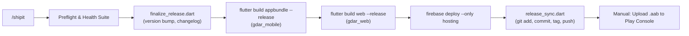
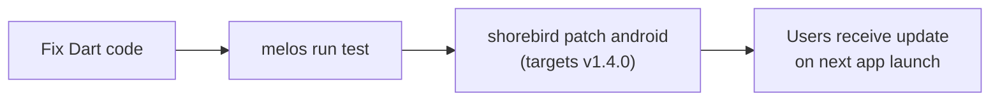

# Shorebird Integration Plan — GDAR v1.4.0

## Overview

Shorebird enables Over-The-Air (OTA) Dart code updates for Android targets
without going through the Play Store review cycle. This plan establishes
v1.4.0 as the first Shorebird-enabled baseline across the GDAR monorepo.

### What Shorebird Can Patch (Dart-side)
- Audio playback logic (`AudioProvider`, gapless engine)
- Show/track metadata parsing (`output.optimized_src.json` bundled asset)
- UI layout, theming, and widget trees
- Provider logic, navigation, and settings

### What Shorebird Cannot Patch (Native-side)
- Native Android plugins (e.g., `just_audio` native layer, `wakelock_plus`)
- Android manifest changes (permissions, intent filters, deep links)
- Gradle config, minSdkVersion, or compileSdkVersion changes
- Any iOS or Web code — these platforms are not supported by Shorebird

### Platform Support Matrix

| Target | Shorebird Support | Update Mechanism |
|---|---|---|
| `gdar_mobile` (Android) | ✅ Yes | OTA patch via Shorebird |
| `gdar_tv` (Android TV) | ✅ Yes | OTA patch via Shorebird |
| `gdar_web` (PWA) | ❌ No | Instant via Firebase Hosting redeploy |
| Production (`v1.1.0+102`) | ⛔ Isolated | Unaffected — different Release ID |

---

## Architecture

### Current Release Flow (`/shipit`)



### Proposed Release Flow (with Shorebird)

```mermaid
graph LR
    A["/shipit"] --> B["Preflight & Health Suite"]
    B --> C["finalize_release.dart<br/>(version bump, changelog)"]
    C --> D["shorebird release android<br/>(gdar_mobile)"]
    D --> E["shorebird release android<br/>(gdar_tv)"]
    E --> F["flutter build web --release<br/>(gdar_web)"]
    F --> G["firebase deploy --only hosting"]
    G --> H["release_sync.dart<br/>(git add, commit, tag, push)"]
    H --> I["Manual: Upload .aab to Play Console"]
```



### Hotfix Patch Flow (new — does NOT require `/shipit`)



> [!IMPORTANT]
> `shorebird release` replaces `flutter build appbundle` — it produces both
> the `.aab` for the Play Store AND registers the release with Shorebird's
> servers. You still upload the `.aab` manually to the Play Console.

---

## Setup (One-Time, Manual)

### 1. Install Shorebird CLI
```powershell
# PowerShell (Windows)
iwr -UseBasicParsing 'https://raw.githubusercontent.com/shorebirdtech/install/main/install.ps1' | iex
```

### 2. Authenticate
```powershell
shorebird login
```

### 3. Initialize Each App Target

Each app target gets its own `shorebird.yaml` with a unique `app_id`.

```powershell
# From apps/gdar_mobile
cd apps/gdar_mobile
shorebird init

# From apps/gdar_tv
cd apps/gdar_tv
shorebird init
```

This creates a `shorebird.yaml` in each app directory:
```yaml
# apps/gdar_mobile/shorebird.yaml
app_id: <unique-mobile-id>
```

> [!WARNING]
> `gdar_web` does NOT get a `shorebird.yaml`. Shorebird has no Web support.
> Web updates continue through Firebase Hosting.

---

## Version Strategy

### Version Baseline
- **Internal Version**: `1.4.0+255` (in all three `pubspec.yaml` files)
- **UI Display**: `Version 1.4.0` (build number hidden)
- **With Patch**: `Version 1.4.0 (Patch 2)`

### How Shorebird Links to Your Version

Shorebird reads `version` from `pubspec.yaml` at release time:

```
pubspec.yaml: version: 1.4.0+255
                         └─────┘
                    Shorebird Release ID
```

- **`shorebird release android`** → Registers `1.4.0+255` as a release.
- **`shorebird patch android`** → Asks which release to patch. You specify `1.4.0+255`.
- Patches are numbered sequentially: Patch 1, Patch 2, Patch 3...

### Track Isolation (Internal vs. Production)

Shorebird patches are **version-locked**, not track-locked. Isolation is
achieved because Internal and Production run different Release IDs:

| Track | Version | Shorebird Release ID | Receives Patches For |
|---|---|---|---|
| Production | `1.1.0+102` | *Not registered* | Nothing (no Shorebird) |
| Internal Testing | `1.4.0+255` | `1.4.0+255` | `1.4.0+255` patches only |

> [!CAUTION]
> A `shorebird patch` targeting `1.4.0+255` will **never** reach Production
> users on `1.1.0+102`. They are completely different binaries. This is the
> primary safety mechanism.

When you eventually promote `v1.4.0` to Production, those users will also
begin receiving patches for `1.4.0+255`.

---

## Code Changes

### 1. Dependency (`packages/shakedown_core/pubspec.yaml`)

Add to the `dependencies:` block:
```yaml
shorebird_code_push: ^1.1.8
```

### 2. DeviceService (`packages/shakedown_core/lib/services/device_service.dart`)

Add a `patchNumber` field and async initialization:

```dart
import 'package:flutter/foundation.dart';
import 'package:shorebird_code_push/shorebird_code_push.dart';

// Inside DeviceService class:
int? _patchNumber;
int? get patchNumber => _patchNumber;

Future<void> _initShorebird() async {
  if (kIsWeb) return; // Shorebird not supported on Web
  try {
    final shorebird = ShorebirdCodePush();
    if (shorebird.isShorebirdAvailable()) {
      _patchNumber = await shorebird.currentPatchNumber();
      notifyListeners();
    }
  } catch (e) {
    // Shorebird unavailable (debug mode, non-Shorebird build, etc.)
    // Fail silently — patchNumber stays null.
  }
}
```

Call `_initShorebird()` at the end of the existing `_init()` method.

### 3. About Screen (`packages/shakedown_core/lib/ui/screens/about_screen.dart`)

Update the version `FutureBuilder` (lines 121–134) to strip the build number
and append the patch:

```dart
FutureBuilder<PackageInfo>(
  future: PackageInfo.fromPlatform(),
  builder: (context, snapshot) {
    if (!snapshot.hasData) {
      return const SizedBox.shrink();
    }
    final version = snapshot.data!.version; // e.g. "1.4.0"
    final deviceService = context.watch<DeviceService>();
    final patch = deviceService.patchNumber;
    final display = patch != null
        ? 'Version $version (Patch $patch)'
        : 'Version $version';
    return Text(
      display,
      style: textTheme.titleMedium?.copyWith(
        color: colorScheme.onSurfaceVariant,
      ),
    );
  },
),
```

> [!NOTE]
> `PackageInfo.version` already returns the version **without** the build
> number (e.g., `"1.4.0"` not `"1.4.0+255"`). No string splitting needed.

---

## Workflow Updates

### `/shipit` Changes

Replace `flutter build appbundle --release` with `shorebird release android`
for the mobile and TV targets. The Web build remains unchanged.

| Step | Before | After |
|---|---|---|
| Android build | `flutter build appbundle --release` (from `gdar_mobile`) | `shorebird release android` (from `gdar_mobile`) |
| TV build | *(shared binary via gdar_mobile)* | `shorebird release android` (from `gdar_tv`) |
| Web build | `flutter build web --release` | *Unchanged* |

### New: `/patch` Workflow (Future)

A new lightweight workflow for Dart-only hotfixes:
1. Run `melos run test` to verify.
2. Run `shorebird patch android` from `apps/gdar_mobile`.
3. Run `shorebird patch android` from `apps/gdar_tv`.
4. Commit with message `hotfix: <description>`.

This workflow does NOT require a version bump, changelog update, or Play
Store upload.

---

## Rollback

If a bad patch is deployed:

```powershell
# List patches for a release
shorebird patch list --app-id <app_id> --release-version 1.4.0+255

# Rollback the latest patch
shorebird patch rollback --app-id <app_id> --release-version 1.4.0+255
```

Users will revert to the previous patch (or the base release if only one
patch existed) on their next app launch.

---

## Error Handling

| Scenario | Behavior |
|---|---|
| Shorebird servers unreachable | `patchNumber` stays `null`, About screen shows version only |
| Web/PWA target | `_initShorebird()` returns early, no crash |
| Debug mode (no Shorebird binary) | `isShorebirdAvailable()` returns `false`, silent fallback |
| No active patch | `currentPatchNumber()` returns `null`, About screen shows version only |

---

## Verification Plan

### Automated
- `melos run test`: Verify zero regressions across all 258 tests.

### Manual Smoke Test

| Step | Expected Result |
|---|---|
| Build and deploy `v1.4.0+255` to Internal Track | About screen shows `Version 1.4.0` |
| Run `shorebird patch android` with a trivial Dart change | About screen updates to `Version 1.4.0 (Patch 1)` on next app launch |
| Run `shorebird patch rollback` | About screen reverts to `Version 1.4.0` |
| Open `gdar_web` in browser | About screen shows `Version 1.4.0`, no crash |
| Verify Production users on `v1.1.0+102` | Completely unaffected |
